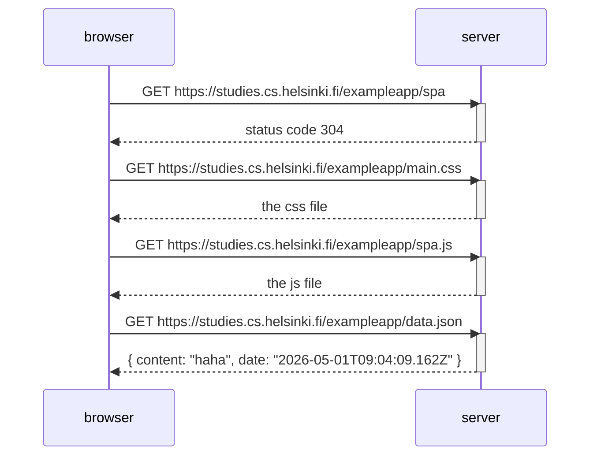

```mermaid
    sequenceDiagram
        participant browser
        participant server

        browser->>server: GET https://studies.cs.helsinki.fi/exampleapp/spa
        activate server
        server-->>browser: status code 304
        deactivate server

        browser->>server: GET https://studies.cs.helsinki.fi/exampleapp/main.css
        activate server
        server-->>browser: the css file
        deactivate server

        browser->>server: GET https://studies.cs.helsinki.fi/exampleapp/spa.js
        activate server
        server-->>browser: the js file
        deactivate server

        browser->>server: GET https://studies.cs.helsinki.fi/exampleapp/data.json
        activate server
        server-->>browser: 	{ content: "haha", date: "2026-05-01T09:04:09.162Z" }
        deactivate server

```