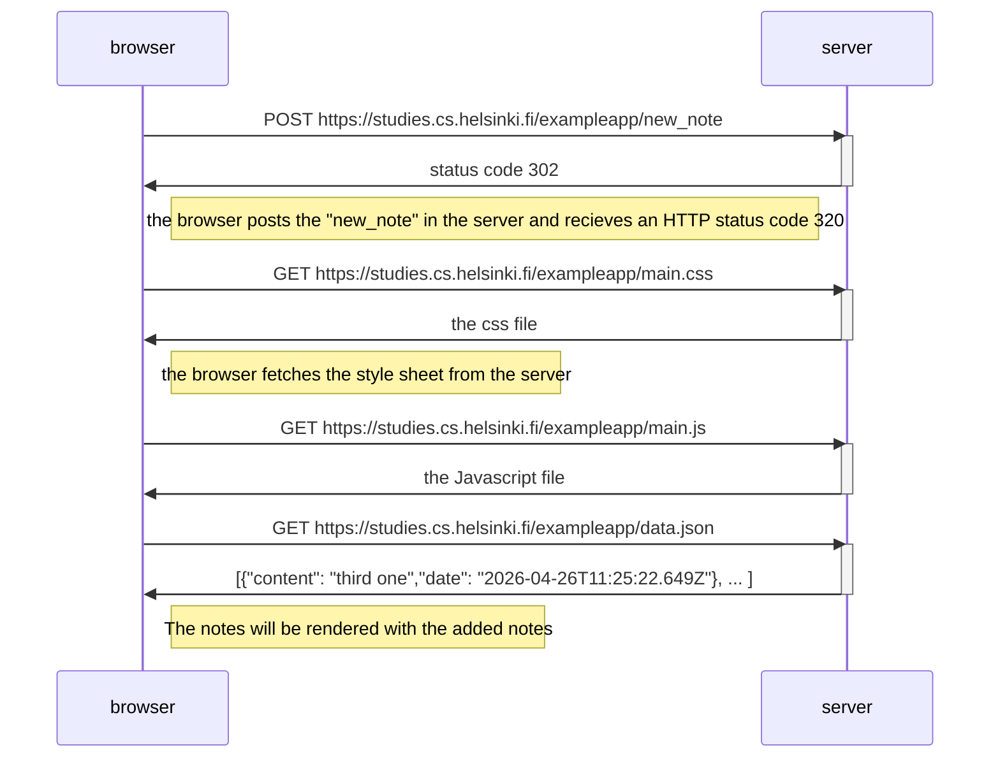

```mermaid
    sequenceDiagram
        participant browser
        participant server

        browser->>server: POST https://studies.cs.helsinki.fi/exampleapp/new_note
        activate server
        server->>browser: status code 302
        deactivate server
        Note right of browser: the browser posts the "new_note" in the server and recieves an HTTP status code 320

        browser->>server: GET https://studies.cs.helsinki.fi/exampleapp/main.css
        activate server
        server->>browser: the css file
        deactivate server
        Note right of browser: the browser fetches the style sheet from the server

        browser->>server: GET https://studies.cs.helsinki.fi/exampleapp/main.js
        activate server
        server->>browser: the Javascript file
        deactivate server

        browser->>server: GET https://studies.cs.helsinki.fi/exampleapp/data.json
        activate server
        server->>browser: [{"content": "third one","date": "2026-04-26T11:25:22.649Z"}, ... ]
        deactivate server
        Note right of browser: The notes will be rendered with the added notes
```